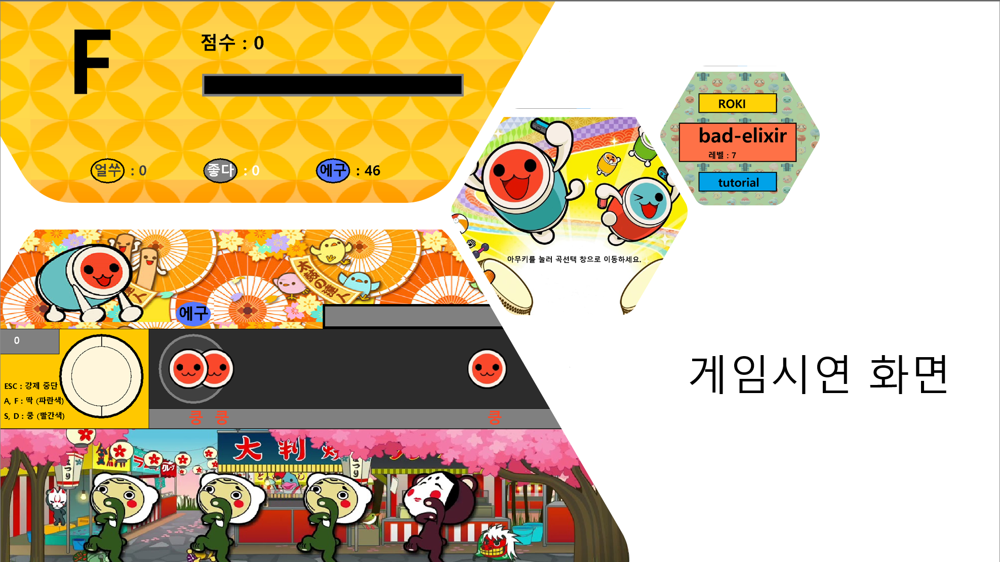

# 자바 수업 과제

태고의 달인 게임을 자바 스윙으로 제작

이 게임은 흥미진진한 리듬 게임으로, 키보드의 특정 키를 눌러 떨어지는 노트를 맞추는 방식으로 진행됩니다. 노트를 정확히 맞추면 점수가 오르고, 놓치면 점수가 깎입니다. 게임의 난이도는 사용자의 선택에 따라 조절할 수 있습니다.

---

## 실행 방법

1. 다운을 받고 압축을 풀어서 Swing_javaclass 의 이름으로 폴더를 생성
2. MainDriver.java를 루트경로로 Swing_javaclass 폴더에 그대로 넣는다
3. MainDriver.java를 실행한다

---

## 시연 화면

